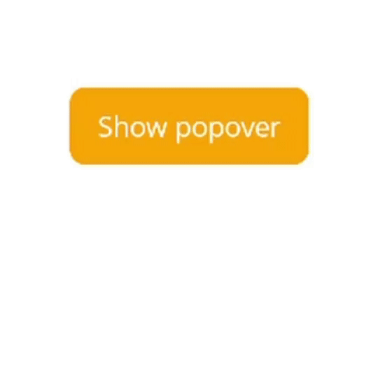
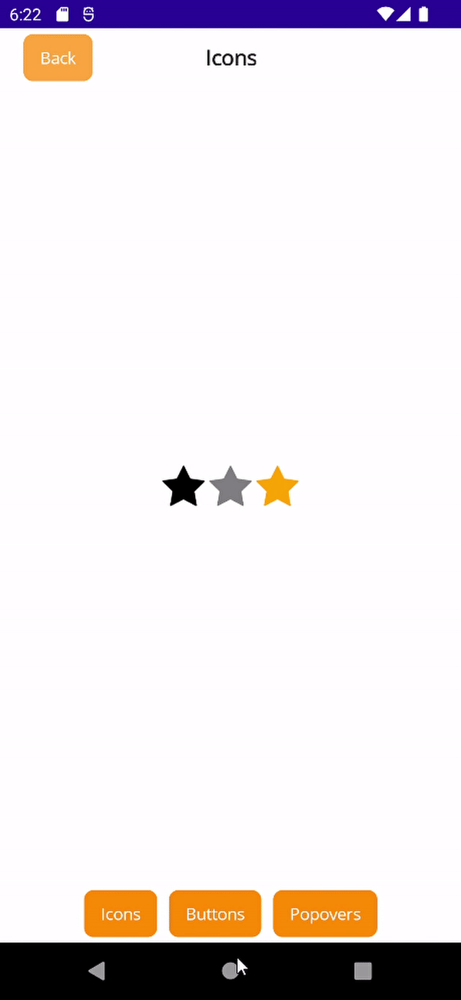
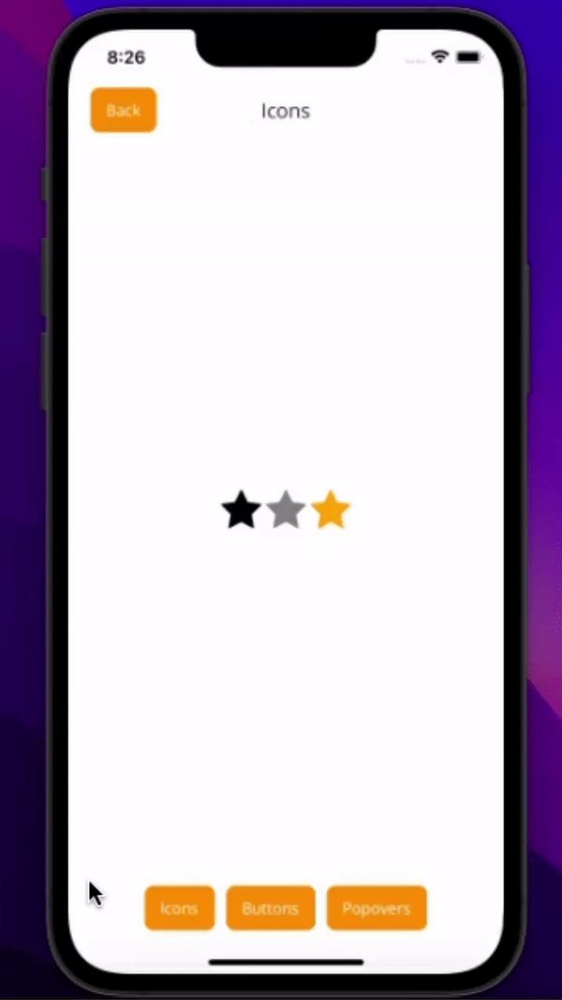

#  SimpleToolkit

SimpleToolkit is a .NET MAUI library of helpers and simple, easily customizable controls.

The library consists of three packages:

- [SimpleToolkit.Core](#simpletoolkitcore)

- [SimpleToolkit.SimpleShell](#simpletoolkitsimpleshell)

- [SimpleToolkit.SimpleShell.Controls](#simpletoolkitsimpleshellcontrols)

> ⚠ **Warning:** Long-term support is not guaranteed. Use at your own risk.

## Samples

Here are some of my samples that were built using this library:

<p align="center">
    
</p>
<p align="center">
    <a href="https://github.com/RadekVyM/Gadgets-Store-App"><em>Gadget Store App</em></a>
</p>
<p align="center">
    
    &nbsp;&nbsp;&nbsp;&nbsp;&nbsp;&nbsp;&nbsp;
    
</p>
<p align="center">
    <a href="https://github.com/RadekVyM/Navbar-Animation-1"><em>Navbar Animation #1</em></a>
</p>
<p align="center">
    
    &nbsp;&nbsp;&nbsp;&nbsp;&nbsp;&nbsp;&nbsp;
    
</p>
<p align="center">
    <a href="https://github.com/RadekVyM/Navbar-Animation-2"><em>Navbar Animation #2</em></a>
</p>

## SimpleToolkit.Core

[](https://www.nuget.org/packages/SimpleToolkit.Core/)

The *SimpleToolkit.Core* package is a set of simple .NET MAUI controls and helpers.

### Getting Started

In order to use *SimpleToolkit.Core*, you need to call the `UseSimpleToolkit()` extension method in your `MauiProgram.cs` file:

```csharp
builder.UseSimpleToolkit();
```

### Icon

Thanks to the `Icon` control, you are able to display a tinted image:

```xml
<simpleCore:Icon Source="star.png"/>
<simpleCore:Icon Source="star.png" TintColor="Gray"/>
<simpleCore:Icon Source="star.png" TintColor="Orange"/>
```

Output:

<p align="center">
    
</p>

#### Implementation details

The `Icon` class is inherited from the .NET MAUI `Image` class, but behind the scenes it is implemented in the same way as .NET MAUI `Image` only on Android and iOS. WinUI implementation is based on `BitmapIcon` and `FontIcon` controls. Because of that, the control supports only these image sources on Windows:

- `FileImageSource`
- `UriImageSource`
- `FontImageSource`

These `Image` properties are not supported at all:

- `Aspect` - the default behavior is `AspectFit`
- `IsAnimationPlaying`
- `IsLoading`
- `IsOpaque`

### ContentButton

`ContentButton` is just a button that can hold whatever content you want:

```xml
<simpleCore:ContentButton Clicked="StarButtonClicked">
    <Border Background="Orange">
        <Border.StrokeShape>
            <RoundRectangle CornerRadius="6"/>
        </Border.StrokeShape>
        <HorizontalStackLayout Padding="12,10" Spacing="10">
            <simpleCore:Icon
                Source="star.png" TintColor="White"
                VerticalOptions="Center"
                HeightRequest="18" WidthRequest="18"/>
            <Label
                Text="Star this repo" TextColor="White"
                FontAttributes="Bold"
                VerticalOptions="Center"/>
        </HorizontalStackLayout>
    </Border>
</simpleCore:ContentButton>
```

Output:

<p align="center">
    
</p>

#### Implementation details

The `ContentButton` class is inherited from the .NET MAUI `ContentView` control. `ContentButton` has these events in addition to `ContentView`s events and properties:

- `Clicked` - an event that fires when the button is clicked
- `Pressed` - an event that fires when the button is pressed
- `Released` - an event that fires when the button is released

### Popover

`Popover` allows you to display custom popovers (flyouts) anchored to any control:

```xml
<Button
    VerticalOptions="Center" HorizontalOptions="Center"
    Clicked="ButtonClicked"
    Text="Show popover"
    Background="Orange">
    <simpleCore:Popover.AttachedPopover>
        <simpleCore:Popover>
            <Border
                Background="DarkOrange">
                <Border.StrokeShape>
                    <RoundRectangle CornerRadius="6"/>
                </Border.StrokeShape>

                <VerticalStackLayout Padding="12,10" Spacing="10">
                    <simpleCore:Icon
                        Source="star.png" TintColor="White"
                        VerticalOptions="Center"
                        HeightRequest="25" WidthRequest="25"/>
                    <Label
                        Text="Star this repo" TextColor="White"
                        FontAttributes="Bold"
                        VerticalOptions="Center"/>
                </VerticalStackLayout>
            </Border>
        </simpleCore:Popover>
    </simpleCore:Popover.AttachedPopover>
</Button>
```

Code behind:

```csharp
private void ButtonClicked(object sender, EventArgs e)
{
    var button = sender as Button;

    button.ShowAttachedPopover();
}
```

Output:

<p align="center">
    <table>
        <tr>
            <th>
                <p align="center">Android</p>
            </th>
            <th>
                <p align="center">iOS</p>
            </th>
            <th>
                <p align="center">Windows</p>
            </th>
        </tr>
        <tr>
            <td>
                
            </td>
            <td>
                
            </td>
            <td>
                
            </td>
        </tr>
    </table>
</p>

#### Implementation details

The `Popover` class is inherited from the .NET MAUI `Element` class. `Popover` offers these properties and methods in addition to `Element`s properties and methods:

- `Content` - the popover content of type `View`
- `Show()` - shows the popover anchored to a view you pass as a parameter
- `Hide()` - hides the popover

Use of the methods mentioned above:

```csharp
popover.Show(anchorView);
popover.Hide();
```

Popover can be attached to a view using the `AttachedPopover` attached property. Such a popover can be displayed or hidden (dismissed) by calling the `ShowAttachedPopover()` and `HideAttachedPopover()` extension methods on the view:

```csharp
button.ShowAttachedPopover();
button.HideAttachedPopover();
```

## SimpleToolkit.SimpleShell

[](https://www.nuget.org/packages/SimpleToolkit.SimpleShell/)

The *SimpleToolkit.SimpleShell* package provides you with a simplified implementation of .NET MAUI `Shell` that lets you easily create a custom navigation experience in your .NET MAUI applications.

### Getting Started

In order to use *SimpleToolkit.SimpleShell*, you need to call the `UseSimpleShell()` extension method in your `MauiProgram.cs` file:

```csharp
builder.UseSimpleShell();
```

### SimpleShell

`SimpleShell` is a simplified implementation of .NET MAUI `Shell`. All `SimpleShell` is is just a simple container for your content with the ability to put the hosting area for pages wherever you want. Thanks to that, you are able to add custom tab bars, navigation bars, flyouts, etc. to your `Shell` application while using great `Shell` URI-based navigation.

```xml
<simpleShell:SimpleShell
    x:Class="SimpleSample.AppShell"
    xmlns="http://schemas.microsoft.com/dotnet/2021/maui"
    xmlns:x="http://schemas.microsoft.com/winfx/2009/xaml"
    xmlns:simpleShell="clr-namespace:SimpleToolkit.SimpleShell;assembly=SimpleToolkit.SimpleShell"
    xmlns:pages="clr-namespace:SimpleSample.Views.Pages"
    x:Name="thisShell">

    <ShellContent
        Title="Icons"
        Icon="icon.png"
        ContentTemplate="{DataTemplate pages:IconPage}"
        Route="IconPage"/>

    <ShellContent
        Title="Buttons"
        Icon="button.png"
        ContentTemplate="{DataTemplate pages:ContentButtonPage}"
        Route="ContentButtonPage"/>

    <ShellContent
        Title="Popovers"
        Icon="popover.png"
        ContentTemplate="{DataTemplate pages:PopoverPage}"
        Route="PopoverPage"/>

    <simpleShell:SimpleShell.Content>
        <Grid
            RowDefinitions="50, *, 50">
            <Button
                x:Name="backButton"
                Clicked="BackButtonClicked"
                Text="Back"
                Margin="20,5"
                HorizontalOptions="Start"
                Background="DarkOrange"/>
            <Label
                Margin="20,5"
                HorizontalOptions="Center" VerticalOptions="Center"
                Text="{Binding CurrentShellContent.Title, Source={x:Reference thisShell}}"
                FontAttributes="Bold" FontSize="18"/>
            <simpleShell:SimpleNavigationHost
                Grid.Row="1"/>
            <HorizontalStackLayout
                x:Name="tabBar"
                Grid.Row="2"
                Margin="20,5"
                HorizontalOptions="Center" Spacing="10"
                BindableLayout.ItemsSource="{Binding ShellContents, Source={x:Reference thisShell}}">
                <BindableLayout.ItemTemplate>
                    <DataTemplate
                        x:DataType="BaseShellItem">
                        <Button
                            Clicked="TabButtonClicked"
                            Background="DarkOrange"
                            Text="{Binding Title}"/>
                    </DataTemplate>
                </BindableLayout.ItemTemplate>
            </HorizontalStackLayout>
        </Grid>
    </simpleShell:SimpleShell.Content>
</simpleShell:SimpleShell>
```

As you can see, the logical navigation structure is defined with `ShellContent`, `Tab`, etc. as in normal .NET MAUI `Shell`. However, visual structure has to be defined manually using the `Content` property. The hosting area for pages is represented by the `SimpleNavigationHost` view that can occur in the visual hierarchy **just once**.

SimpleShell provides you with some bindable properties which simplify the creation of custom navigation controls:

- `CurrentPage` - the currently selected `Page`
- `CurrentShellSection` - the currently selected `ShellSection` (`Tab`)
- `CurrentShellContent` - the currently selected `ShellContent`
- `ShellSections` - read-only list of all `ShellSection`s in the shell
- `ShellContents` - read-only list of all `ShellContent`s in the shell

The code behind of the XAML sample above:

```csharp
private async void TabButtonClicked(object sender, EventArgs e)
{
    var button = sender as Button;
    var shellItem = button.BindingContext as BaseShellItem;

    // Navigate to a new tab if it is not the current tab
    if (!CurrentState.Location.OriginalString.Contains(shellItem.Route))
        await this.GoToAsync($"///{shellItem.Route}");
}
```

Navigation between pages works exactly the same as in .NET MAUI `Shell`, just use the common `Shell.Current.GoToAsync()`. Pages that are not part of the shell hierarchy can be registered using the `Routing.RegisterRoute()` method.

Output:

<p align="center">
    <table>
        <tr>
            <th>
                <p align="center">Android</p>
            </th>
            <th>
                <p align="center">iOS</p>
            </th>
            <th>
                <p align="center">Windows</p>
            </th>
        </tr>
        <tr>
            <td>
                
            </td>
            <td>
                
            </td>
            <td>
                
            </td>
        </tr>
    </table>
</p>

#### Visual states

`SimpleShell` provides multiple groups of states.

#### `ShellSection` states

States in the `SimpleShellSectionState.[ShellSection route]` format:

```xml
<VisualStateManager.VisualStateGroups>
    <VisualStateGroup x:Name="SimpleShellSectionStates">
        <VisualState x:Name="SimpleShellSectionState.HomeTab">
            <VisualState.Setters>
                <Setter TargetName="tabBar" Property="View.Background" Value="Red"/>
            </VisualState.Setters>
        </VisualState>
        <VisualState x:Name="SimpleShellSectionState.SettingsTab">
            <VisualState.Setters>
                <Setter TargetName="tabBar" Property="View.Background" Value="Green"/>
            </VisualState.Setters>
        </VisualState>
    </VisualStateGroup>
</VisualStateManager.VisualStateGroups>
```

When a user navigates to a tab with a `HomeTab` route, the view named `tabBar` will have a red background, and when to a tab with a `SettingsTab` route, the view named `tabBar` will have a green background. 

#### `ShellContent` states

States in the `SimpleShellContentState.[ShellContent route]` format:

```xml
<VisualStateManager.VisualStateGroups>
    <VisualStateGroup x:Name="SimpleShellContentStates">
        <VisualState x:Name="SimpleShellContentState.HomePage">
            <VisualState.Setters>
                <Setter TargetName="tabBar" Property="View.Background" Value="Yellow"/>
            </VisualState.Setters>
        </VisualState>
        <VisualState x:Name="SimpleShellContentState.SettingsPage">
            <VisualState.Setters>
                <Setter TargetName="tabBar" Property="View.Background" Value="Blue"/>
            </VisualState.Setters>
        </VisualState>
    </VisualStateGroup>
</VisualStateManager.VisualStateGroups>
```

When a user navigates to a `ShellContent` with a `HomePage` route, the view named `tabBar` will have a yellow background, and when to a `ShellContent` with a `SettingsPage` route, the view named `tabBar` will have a blue background.

#### Page type states

States in the `SimplePageState.[Page type name]` format:

```xml
<VisualStateManager.VisualStateGroups>
    <VisualStateGroup x:Name="SimplePageStates">
        <VisualState x:Name="SimplePageState.HomePage">
            <VisualState.Setters>
                <Setter TargetName="tabBar" Property="View.Background" Value="Purple"/>
            </VisualState.Setters>
        </VisualState>
        <VisualState x:Name="SimplePageState.SettingsPage">
            <VisualState.Setters>
                <Setter TargetName="tabBar" Property="View.Background" Value="Orange"/>
            </VisualState.Setters>
        </VisualState>
    </VisualStateGroup>
</VisualStateManager.VisualStateGroups>
```

When a user navigates to a `HomePage` page, the view named `tabBar` will have a purple background, and when to a `SettingsPage` page, the view named `tabBar` will have a orange background. 

#### Navigation stack states

When a user navigates to a page that is part of the shell hierarchy, `SimpleShell` goes to the `RootPage` state, otherwise `SimpleShell` goes to the `RegisteredPage` state:

```xml
<VisualStateManager.VisualStateGroups>
    <VisualStateGroup x:Name="SimplePageTypeStates">
        <VisualState x:Name="SimplePageTypeState.RegisteredPage">
            <VisualState.Setters>
                <Setter TargetName="backButton" Property="Button.IsVisible" Value="true"/>
            </VisualState.Setters>
        </VisualState>
        <VisualState x:Name="SimplePageTypeState.RootPage">
            <VisualState.Setters>
                <Setter TargetName="backButton" Property="Button.IsVisible" Value="false"/>
            </VisualState.Setters>
        </VisualState>
    </VisualStateGroup>
</VisualStateManager.VisualStateGroups>
```

#### Why not use `SimpleShell` and use .NET MAUI `Shell` instead

- .NET MAUI `Shell` offers a platform-specific appearance.
- Platform-specific navigation controls that .NET MAUI `Shell` provides probably have better performance than controls composed of multiple .NET MAUI views.
- A `SimpleShell`-based application may not have as good accessibility in some scenarios due to the lack of platform-specific navigation controls. .NET MAUI `Shell` should be accessible out of the box since it uses platform-specific controls.
- Maybe I have implemented something wrong that has a negative impact on the performance, accessibility, or something like that.

#### Implementation details

The `SimpleShell` class is inherited from the .NET MAUI `Shell` class, but all the handlers are implemented from the ground up. These handlers are inspired by the WinUI `Shell` handlers.

`SimpleShell` currently does not provide any page transitions. Pages are simply swapped in a container during navigation.

## SimpleToolkit.SimpleShell.Controls

[](https://www.nuget.org/packages/SimpleToolkit.SimpleShell.Controls/)

*SimpleToolkit.SimpleShell.Controls* is a collection of ready-to-use, navigation-related controls (not only) for `SimpleShell`.

### Getting Started

In order to use *SimpleToolkit.SimpleShell.Controls*, you need to call the `UseSimpleToolkit()` extension method in your `MauiProgram.cs` file:

```csharp
builder.UseSimpleToolkit();
```

<p align="center">
    <a href="https://giphy.com/gifs/wiesemann1893-transparent-logo-wiesemann-dWa2rUaiahx1FB3jor">
        
    </a>
</p>