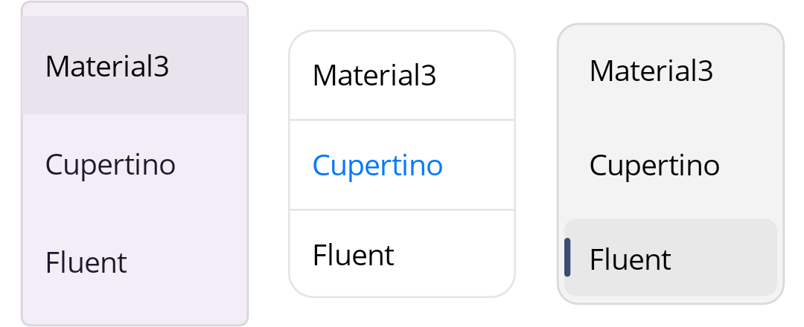
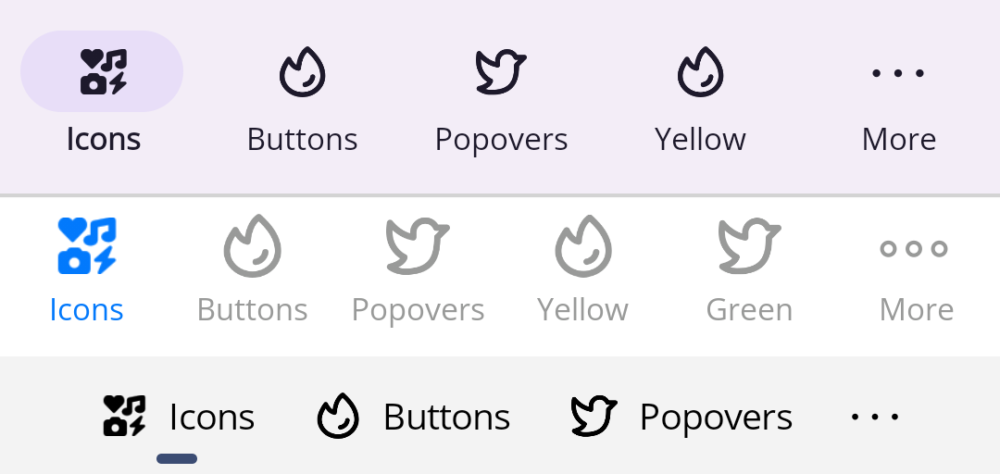

#  SimpleToolkit

SimpleToolkit is a .NET MAUI library of helpers and simple, easily customizable controls.

The library consists of three NuGet packages:

- [SimpleToolkit.Core](#simpletoolkitcore) - set of simple .NET MAUI controls and helpers

    [](https://www.nuget.org/packages/SimpleToolkit.Core/)

- [SimpleToolkit.SimpleShell](#simpletoolkitsimpleshell) - simplified implementation of .NET MAUI `Shell`

    [](https://www.nuget.org/packages/SimpleToolkit.SimpleShell/)

- [SimpleToolkit.SimpleShell.Controls](#simpletoolkitsimpleshellcontrols) - collection of ready-to-use, navigation-related controls

    [](https://www.nuget.org/packages/SimpleToolkit.SimpleShell.Controls/)

I have split the content of this library into three NuGet packages because there may be people who want to use only the `SimpleShell` control, for example, and do not want to use other controls.

> ⚠ **Warning:** Long-term support is not guaranteed. Use at your own risk.

## Samples

Here are some of my samples that were built using this library:

<p align="center">
    
</p>
<p align="center">
    <a href="https://github.com/RadekVyM/Gadgets-Store-App"><em>Gadget Store App</em></a>
</p>
<p align="center">
    
    &nbsp;&nbsp;&nbsp;&nbsp;&nbsp;&nbsp;&nbsp;
    
</p>
<p align="center">
    <a href="https://github.com/RadekVyM/Navbar-Animation-1"><em>Navbar Animation #1</em></a>
</p>
<p align="center">
    
    &nbsp;&nbsp;&nbsp;&nbsp;&nbsp;&nbsp;&nbsp;
    
</p>
<p align="center">
    <a href="https://github.com/RadekVyM/Navbar-Animation-2"><em>Navbar Animation #2</em></a>
</p>

List of all samples can be seen [here](./docs/Samples.md).

## SimpleToolkit.Core

[](https://www.nuget.org/packages/SimpleToolkit.Core/)
[](./docs/SimpleToolkit.Core)

The *SimpleToolkit.Core* package is a set of simple .NET MAUI controls and helpers.

These are all the controls this package has to offer:

- [Icon](./docs/SimpleToolkit.Core/Icon.md) - control that allows you to display a tinted image
- [ContentButton](./docs/SimpleToolkit.Core/ContentButton.md) - button that can hold whatever content you want
- [Popover](./docs/SimpleToolkit.Core/Popover.md) - control that allows you to display custom popovers (flyouts) anchored to any control

In order to use the controls listed above, you need to call the `UseSimpleToolkit()` extension method in your `MauiProgram.cs` file:

```csharp
builder.UseSimpleToolkit();
```

The package also contains some useful helpers for managing the safe area of an application window. For example, there are helpers that allow you to force application content to be displayed behind system bars (status and navigation bars) on Android and iOS.

See [documentation](./docs/SimpleToolkit.Core) for more information.

## SimpleToolkit.SimpleShell

[](https://www.nuget.org/packages/SimpleToolkit.SimpleShell/)
[](./docs/SimpleToolkit.SimpleShell)

The *SimpleToolkit.SimpleShell* package provides you with a simplified implementation of .NET MAUI `Shell` that lets you easily create a custom navigation experience in your .NET MAUI applications. The implementation is simply called `SimpleShell`.

All `SimpleShell` is is just a simple container for your content with the ability to put the hosting area for pages wherever you want. Thanks to that, you are able to add custom tab bars, navigation bars, flyouts, etc. to your `Shell` application while using great `Shell` URI-based navigation.

### Why not use `SimpleShell` and use .NET MAUI `Shell` instead

- .NET MAUI `Shell` offers a platform-specific appearance.
- Platform-specific navigation controls that .NET MAUI `Shell` provides probably have better performance than controls composed of multiple .NET MAUI views.
- A `SimpleShell`-based application may not have as good accessibility in some scenarios due to the lack of platform-specific navigation controls. .NET MAUI `Shell` should be accessible out of the box since it uses platform-specific controls.
- Maybe I have implemented something wrong that has a negative impact on the performance, stability, accessibility, or something like that.

See [documentation](./docs/SimpleToolkit.SimpleShell) for more information.

## SimpleToolkit.SimpleShell.Controls

[](https://www.nuget.org/packages/SimpleToolkit.SimpleShell.Controls/)
[](./docs/SimpleToolkit.SimpleShell.Controls)

*SimpleToolkit.SimpleShell.Controls* is a collection of ready-to-use, navigation-related controls (not only) for `SimpleShell`.

The package currently supports only two controls:

- `ListPopover` - popover containing a list of selectable text items
- `TabBar`

All controls can be styled using different design languages. These are currently supported:

- Material 3
- Cupertino
- Fluent (WinUI 3)

<p align="center">
    
</p>

<p align="center">
    
</p>

<p align="center">
    <a href="https://giphy.com/gifs/wiesemann1893-transparent-logo-wiesemann-dWa2rUaiahx1FB3jor">
        
    </a>
</p>

> I am still not decided if I want to continue and how to develop the `SimpleToolkit.SimpleShell.Controls` package. **The package API is likely to change in the future.** For this reason, this package is still in preview and has poor documentation.

See [documentation](./docs/SimpleToolkit.SimpleShell.Controls) for more information.
