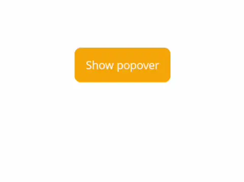
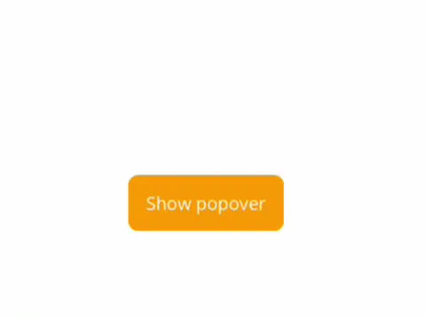
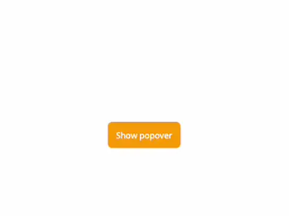
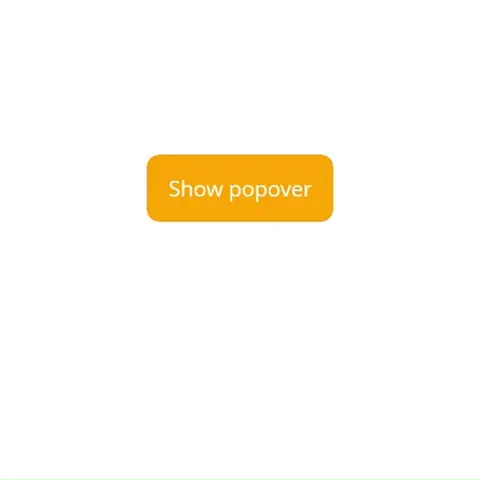
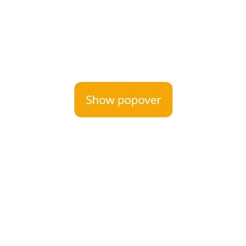

# Popover

`Popover` allows you to display custom popovers (flyouts) anchored to any control. In order to use this control, you need to call the `UseSimpleToolkit()` extension method in your `MauiProgram.cs` file:

```csharp
builder.UseSimpleToolkit();
```

`Popover` and all related classes and methods can be found in the following namespace:

```csharp
using SimpleToolkit.Core;
```

Or in the following XAML namespace:

```xml
xmlns:simpleCore="clr-namespace:SimpleToolkit.Core;assembly=SimpleToolkit.Core"
```

## Example

Simple popover anchored to a button can be defined as follows:

```xml
<Button
    VerticalOptions="Center" HorizontalOptions="Center"
    Clicked="ButtonClicked"
    Text="Show popover"
    Background="Orange">
    <simpleCore:Popover.AttachedPopover>
        <simpleCore:Popover>
            <Border
                Background="DarkOrange">
                <Border.StrokeShape>
                    <RoundRectangle CornerRadius="6"/>
                </Border.StrokeShape>

                <VerticalStackLayout Padding="12,10" Spacing="10">
                    <simpleCore:Icon
                        Source="star.png"
                        TintColor="White"
                        VerticalOptions="Center"
                        HeightRequest="25" WidthRequest="25"/>
                    <Label
                        Text="Do you like this repo?"
                        TextColor="White"
                        FontAttributes="Bold"
                        VerticalOptions="Center"/>
                </VerticalStackLayout>
            </Border>
        </simpleCore:Popover>
    </simpleCore:Popover.AttachedPopover>
</Button>
```

Popover can be attached to a view using the `AttachedPopover` attached property. Such a popover can be displayed or hidden (dismissed) by calling the `ShowAttachedPopover()` and `HideAttachedPopover()` extension methods on the view:

```csharp
private void ButtonClicked(object sender, EventArgs e)
{
    var button = sender as Button;

    button.ShowAttachedPopover();
}
```

Output:

<p align="center">
    <table>
        <tr>
            <th>
                <p align="center">Android</p>
            </th>
            <th>
                <p align="center">iOS</p>
            </th>
        </tr>
        <tr>
            <td>
                
            </td>
            <td>
                
            </td>
        </tr>
         <tr>
            <th>
                <p align="center">macOS</p>
            </th>
            <th>
                <p align="center">Windows</p>
            </th>
        </tr>
        <tr>
            <td>
                
            </td>
            <td>
                
            </td>
        </tr>
    </table>
</p>

## Properties and methods

The `Popover` class is inherited from the .NET MAUI `Element` class. `Popover` offers these essential properties and methods in addition to `Element`s properties and methods:

- `Content` - the popover content of type `View`
- `Show()` - shows the popover anchored to a view you pass as a parameter
- `Hide()` - hides the popover

Use of the methods mentioned above:

```csharp
popover.Show(anchorView);
popover.Hide();
```

Popover can be attached to a view using the `AttachedPopover` attached property. Such a popover can be displayed or hidden (dismissed) by calling the `ShowAttachedPopover()` and `HideAttachedPopover()` extension methods on the view:

```csharp
button.ShowAttachedPopover();
button.HideAttachedPopover();
```

### `UseDefaultStyling`

Using the `UseDefaultStyling` boolean property, we can define whether the default platform-specific styling of the popover should be used. The default value is `false`. If we set the property to `true`, following results will be achieved:

<p align="center">
    <table>
        <tr>
            <th>
                <p align="center">Android</p>
            </th>
            <th>
                <p align="center">iOS</p>
            </th>
        </tr>
        <tr>
            <td>
                
            </td>
            <td>
                
            </td>
        </tr>
         <tr>
            <th>
                <p align="center">macOS</p>
            </th>
            <th>
                <p align="center">Windows</p>
            </th>
        </tr>
        <tr>
            <td>
                
            </td>
            <td>
                
            </td>
        </tr>
    </table>
</p>

### `Alignment`

On Android and Windows, popover alignment can be defined using the `Alignment` property. This property accepts a value of the `PopoverAlignment` enumeration type:

- `Center` - popover is centered to its anchor
- `Start` - popover is aligned to the left edge of its anchor
- `End` - popover is aligned to the right edge of its anchor

### `PermittedArrowDirections`

On iOS, permitted arrow directions can be defined using the `PermittedArrowDirections` property. This property accepts flags of the `PopoverArrowDirection` enumeration type:

- `Unknown` - the status of the arrow is currently unknown
- `Up` - an arrow points upward
- `Down` - an arrow points downward
- `Left` - an arrow points toward the left
- `Right` - an arrow points toward the right
- `Any` - an arrow points in any direction. This is the default value

We can, for example, allow the arrow to point only upward or downward:

```csharp
popover.PermittedArrowDirections = PopoverArrowDirection.Up | PopoverArrowDirection.Down;
```

### `IsAnimated`

Show and hide animations of a popover can be disabled using the `IsAnimated` boolean property. If we set the property to `true`, animations are enabled, otherwise disabled.