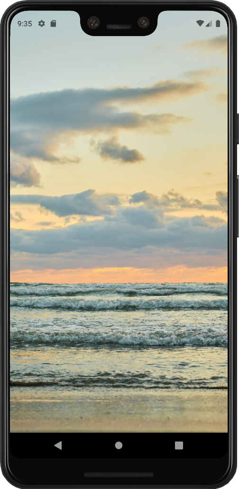
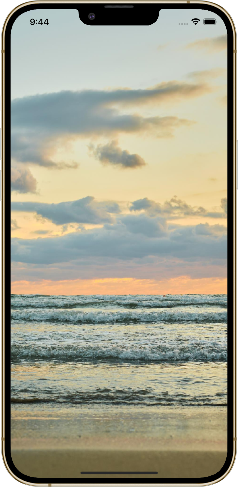
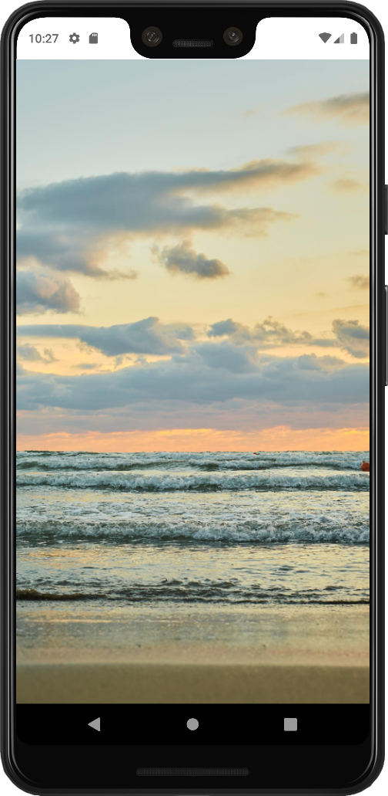
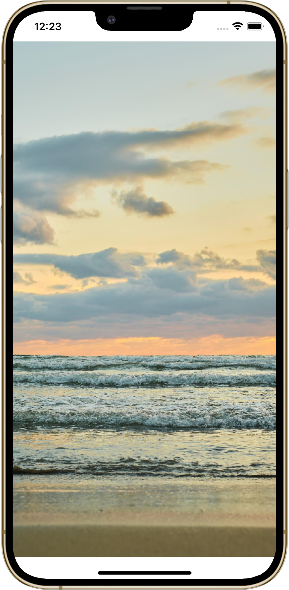

# Safe area helpers

Helpers for managing the safe area of an application window.

## Application content behind system bars

Thanks to the `DisplayContentBehindBars()` extension method, you can force application content to be displayed behind system bars (status and navigation bars) on **Android** and **iOS**. Just call the method on a `MauiAppBuilder` instance in your `MauiProgram.cs` file:

```csharp
builder.DisplayContentBehindBars();
```

Output:

<p align="center">
    
    &nbsp;&nbsp;&nbsp;&nbsp;&nbsp;&nbsp;&nbsp;
    
</p>

<p align="center">
    <em><a href="https://www.freepik.com/free-photo/sandy-beach-sunset-sea-with-colorful-clouds-orange-sunlight-vertical-frame-autumn-sunsets-early-autumn-velvet-season-idea-background-splash-screen_31598694.htm#query=maui&position=2&from_view=search">Image by ededchechine</a> on Freepik</em>
</p>

The method also sets the status bar background color to transparent and the text color to dark color on Android to match the look with iOS.

> 

### Implementation details

A different approach is used on each platform:

- **Android** - the `WindowCompat.SetDecorFitsSystemWindows()` method is called on creation of each activity that represents a window.
- **iOS** - the `IgnoreSafeArea` property is set to `true` on each layout that is inherited from the `Layout` class. This overrides set values of this property on all layouts.
- **Windows** - this feature has not been implemented on Windows yet.

## Safe area insets

Safe area insets can be obtained by subscribing to safe area changes using the `SubscribeToSafeAreaChanges()` extension method of a window:

```csharp
protected override void OnNavigatedTo(NavigatedToEventArgs args)
{
    base.OnNavigatedTo(args);

    this.Window.SubscribeToSafeAreaChanges(OnSafeAreaChanged);
}

private void OnSafeAreaChanged(Thickness safeAreaPadding)
{
    this.Padding = safeAreaPadding;
}
```

The `SubscribeToSafeAreaChanges()` method requires a method (listener) of type `Action<Thickess>` as a parameter. The passed method is called during the call of the `SubscribeToSafeAreaChanges()` method and every time the safe area of the window changes.

Subscription of the safe area changes can be canceled using the `UnsubscribeFromSafeAreaChanges()` extension method. This method takes as a parameter the method you want to unsubscribe:

```csharp
protected override void OnNavigatedFrom(NavigatedFromEventArgs args)
{
    base.OnNavigatedFrom(args);

    this.Window.UnsubscribeFromSafeAreaChanges(OnSafeAreaChanged);
}
```

Output:

<p align="center">
    
    &nbsp;&nbsp;&nbsp;&nbsp;&nbsp;&nbsp;&nbsp;
    
</p>

<p align="center">
    <em><a href="https://www.freepik.com/free-photo/sandy-beach-sunset-sea-with-colorful-clouds-orange-sunlight-vertical-frame-autumn-sunsets-early-autumn-velvet-season-idea-background-splash-screen_31598694.htm#query=maui&position=2&from_view=search">Image by ededchechine</a> on Freepik</em>
</p>