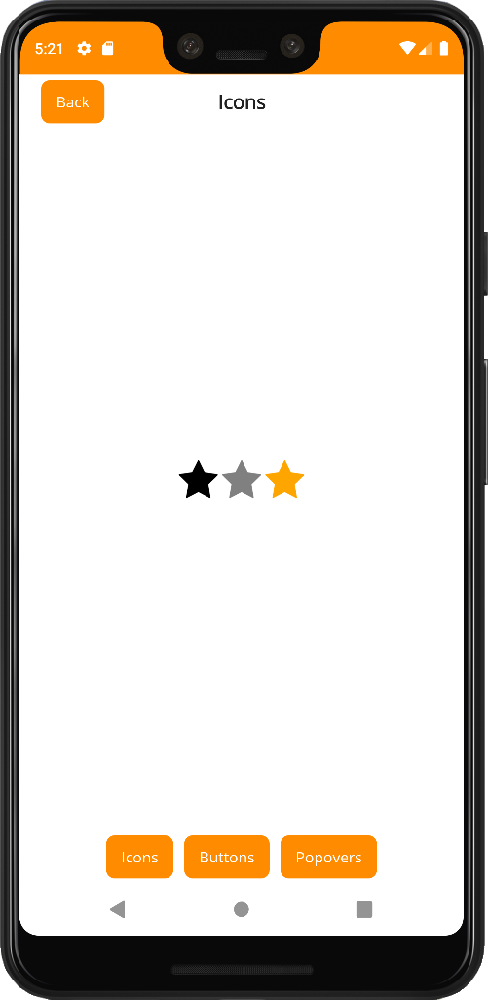

# System bars helpers

Helpers for changing the system bars appearance **on Android**:

```csharp
#if ANDROID

this.Window.SetStatusBarAppearance(color: Colors.DarkOrange, lightElements: true);
this.Window.SetNavigationBarAppearance(color: Colors.White, lightElements: false);

#endif
```

The status bar appearance of a window can be changed using the `SetStatusBarAppearance()` extension method. The navigation bar appearance of a window can be changed using the `SetNavigationBarAppearance()` extension method. Both methods take two parameters:

- `color` - new background color of the bar
- `lightElements` - whether text and icons should be light or dark

Output:

<p align="center">
    
</p>

> This can also be done using [.NET MAUI Community Toolkit](https://github.com/CommunityToolkit/Maui) features that offer more options.

## Default appearance

Default appearance of the bars for each window can be changed using the `SetDefaultStatusBarAppearance()` and `SetDefaultNavigationBarAppearance()` extension methods. These methods has to be called on a `MauiAppBuilder` instance in your `MauiProgram.cs` file:

```csharp
#if ANDROID

builder.SetDefaultStatusBarAppearance(color: Colors.DarkOrange, lightElements: true);
builder.SetDefaultNavigationBarAppearance(color: Colors.White, lightElements: false);

#endif
```