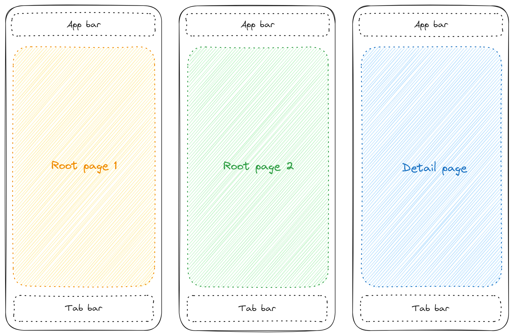
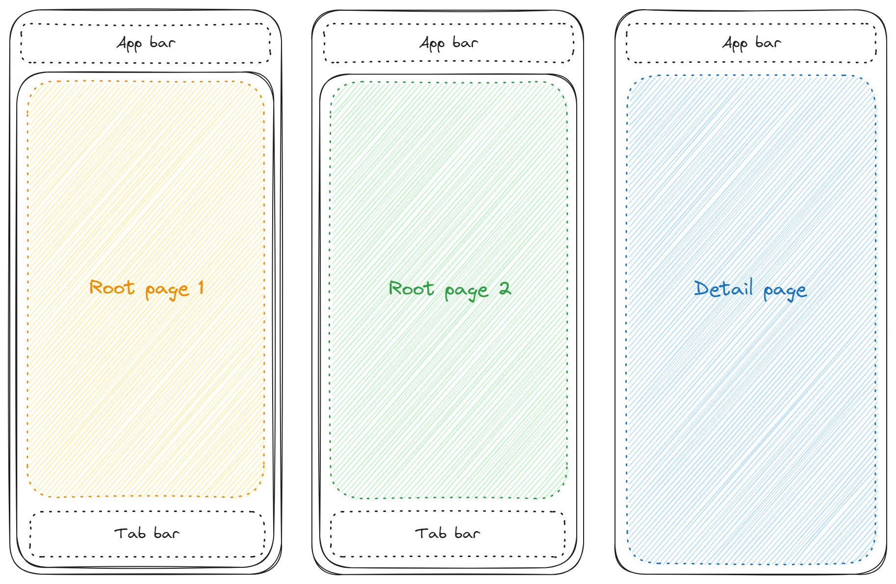
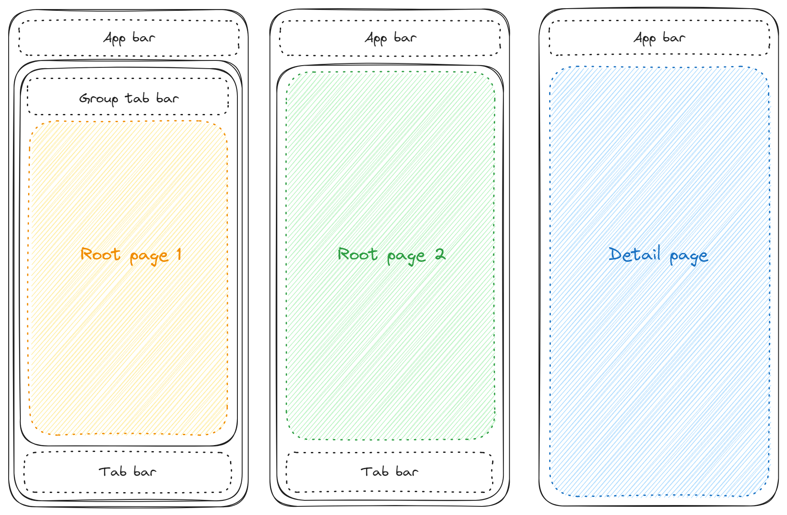

# SimpleToolkit.SimpleShell

[](https://www.nuget.org/packages/SimpleToolkit.SimpleShell/)

`SimpleShell` is a lightweight, decoupled implementation of .NET MAUI `Shell`. It allows you to create entirely custom navigation experiences while retaining the core benefits of `Shell`:

* **Centralized Hierarchy**: Describe your app's logical structure in one place.
* **URI Navigation**: Use the standard URI-based scheme for flexible navigation.

`SimpleShell` provides the infrastructure for navigation but **does not include any UI controls** (like TabBars or Flyouts). You have full freedom to build these using custom .NET MAUI views.

> [!IMPORTANT]
> Before you begin using `SimpleShell`, I highly recommend familiarizing yourself with the standard .NET MAUI `Shell` — especially with the URI-based [navigation](https://learn.microsoft.com/en-us/dotnet/maui/fundamentals/shell/navigation), which works exactly the same as in `SimpleShell`.

## Getting Started

Initialize the library in your `MauiProgram.cs` file:

```csharp
builder.UseSimpleShell(usePlatformTransitions: true);
```

This method also takes a boolean `usePlatformTransitions` parameter, which defaults to `true` and controls whether platform-specific page transitions are used.

`SimpleShell` uses platform-specific page transitions by default. Although, these page transitions can be modified, it is quite limited. If you want to take full control over the transitions, you need to disable the platform-specific ones by setting the `usePlatformTransitions` parameter to `false` and define your own [platform-independent animations](Transitions.md).

### XAML namespace

All `SimpleShell` related controls and attached properties can be found in the following XAML namespace:

```xml
xmlns:simpleShell="clr-namespace:SimpleToolkit.SimpleShell;assembly=SimpleToolkit.SimpleShell"
```

## Defining the Logical Hierarchy

`SimpleShell` uses the same building blocks as standard Shell: `ShellContent`, `Tab`, `TabBar`, and `FlyoutItem`.

> Even though `SimpleShell` inherits from the `Shell` class, many of its properites are not mapped to any platform controls. However, you can bind these properties to your custom controls.

Let's say we want to have an app with four root pages — `YellowPage`, `GreenPage`, `RedPage` and `BluePage` — and one detail page — `YellowDetailPage`. In `SimpleShell`, the logical hierarchy of the app can be defined like this:

```xml
<?xml version="1.0" encoding="UTF-8" ?>
<simpleShell:SimpleShell
    x:Class="SimpleToolkit.SimpleShellSample.AppShell"
    xmlns="http://schemas.microsoft.com/dotnet/2021/maui"
    xmlns:x="http://schemas.microsoft.com/winfx/2009/xaml"
    xmlns:simpleShell="clr-namespace:SimpleToolkit.SimpleShell;assembly=SimpleToolkit.SimpleShell"
    xmlns:pages="clr-namespace:SimpleToolkit.SimpleShellSample.Views.Pages"
    x:Name="thisShell"

    Background="White">

    <TabBar>
        <!-- Pages can be grouped into tabs (ShellSections) -->
        <Tab
            Title="Yellow-Green"
            Route="YellowGreenTab">
            <ShellContent
                Title="Yellow"
                ContentTemplate="{DataTemplate pages:YellowPage}"
                Route="YellowPage"/>

            <ShellContent
                Title="Green"
                ContentTemplate="{DataTemplate pages:GreenPage}"
                Route="GreenPage"/>
        </Tab>

        <Tab
            Title="Red"
            Route="RedTab">
            <ShellContent
                Title="Red"
                ContentTemplate="{DataTemplate pages:RedPage}"
                Route="RedPage"/>
        </Tab>

        <Tab
            Title="Blue"
            Route="BlueTab">
            <ShellContent
                Title="Blue"
                ContentTemplate="{DataTemplate pages:BluePage}"
                Route="BluePage"/>
        </Tab>
    </TabBar>

</simpleShell:SimpleShell>
```

As you can see, the logical hierarchy is defined using `ShellContent`, `Tab`, `TabBar`, and `FlyoutItem` elements, mirroring the standard .NET MAUI `Shell`.

> **Note:** In this context, `TabBar` and `FlyoutItem` are referred to as `ShellItem`, and the `Tab` element is referred to as `ShellSection`, following their predecessor classes.

In `SimpleShell`, the specific semantics of `TabBar` and `FlyoutItem` are ignored; they are functionally interchangeable, and you can even use the base `ShellItem` directly. Additionally, `SimpleShell` supports using multiple `TabBar` elements simultaneously.

Just like in the standard .NET MAUI `Shell`, the `ShellItem` and `ShellSection` wrappers can be omitted and will be implicitly generated:

```xml
<?xml version="1.0" encoding="UTF-8" ?>
<simpleShell:SimpleShell
    x:Class="SimpleToolkit.SimpleShellSample.AppShell"
    xmlns="http://schemas.microsoft.com/dotnet/2021/maui"
    xmlns:x="http://schemas.microsoft.com/winfx/2009/xaml"
    xmlns:simpleShell="clr-namespace:SimpleToolkit.SimpleShell;assembly=SimpleToolkit.SimpleShell"
    xmlns:pages="clr-namespace:SimpleToolkit.SimpleShellSample.Views.Pages"
    x:Name="thisShell"

    Background="White">

    <Tab
        Title="Yellow-Green"
        Route="YellowGreenTab">
        <ShellContent
            Title="Yellow"
            ContentTemplate="{DataTemplate pages:YellowPage}"
            Route="YellowPage"/>

        <ShellContent
            Title="Green"
            ContentTemplate="{DataTemplate pages:GreenPage}"
            Route="GreenPage"/>
    </Tab>

    <ShellContent
        Title="Red"
        ContentTemplate="{DataTemplate pages:RedPage}"
        Route="RedPage"/>

    <ShellContent
        Title="Blue"
        ContentTemplate="{DataTemplate pages:BluePage}"
        Route="BluePage"/>

</simpleShell:SimpleShell>
```

#### Detail Pages

Register detail routes in your code-behind as usual:

```csharp
public partial class AppShell : SimpleToolkit.SimpleShell.SimpleShell
{
    public AppShell()
    {
        InitializeComponent();

        Routing.RegisterRoute(nameof(YellowDetailPage), typeof(YellowDetailPage));
    }
}
```

## Visual Structure & Navigation Hosts

At this moment, there are no navigation controls in the app. A simple app bar and tab bar can be defined like this:

```xml
<?xml version="1.0" encoding="UTF-8" ?>
<simpleShell:SimpleShell
    x:Class="SimpleToolkit.SimpleShellSample.AppShell"
    xmlns="http://schemas.microsoft.com/dotnet/2021/maui"
    xmlns:x="http://schemas.microsoft.com/winfx/2009/xaml"
    xmlns:simpleShell="clr-namespace:SimpleToolkit.SimpleShell;assembly=SimpleToolkit.SimpleShell"
    xmlns:pages="clr-namespace:SimpleToolkit.SimpleShellSample.Views.Pages"
    x:Name="thisShell"

    Background="White">

    <Tab
        Title="Yellow-Green"
        Route="YellowGreenTab">
        <ShellContent
            Title="Yellow"
            ContentTemplate="{DataTemplate pages:YellowPage}"
            Route="YellowPage"/>

        <ShellContent
            Title="Green"
            ContentTemplate="{DataTemplate pages:GreenPage}"
            Route="GreenPage"/>
    </Tab>

    <ShellContent
        Title="Red"
        ContentTemplate="{DataTemplate pages:RedPage}"
        Route="RedPage"/>

    <ShellContent
        Title="Blue"
        ContentTemplate="{DataTemplate pages:BluePage}"
        Route="BluePage"/>

    <simpleShell:SimpleShell.Content>
        <Grid
            RowDefinitions="50, *, 50">
            <Button
                x:Name="backButton"
                Clicked="BackButtonClicked"
                Text="Back"
                Margin="20,5"
                HorizontalOptions="Start"
                Background="Black"/>
            <Label
                Margin="20,5"
                HorizontalOptions="Center" VerticalOptions="Center"
                Text="{Binding CurrentShellContent.Title, Source={x:Reference thisShell}}"
                FontAttributes="Bold" FontSize="18"/>
            <simpleShell:SimpleNavigationHost
                Grid.Row="1"/>
            <HorizontalStackLayout
                x:Name="tabBar"
                Grid.Row="2"
                Margin="20,5"
                HorizontalOptions="Center" Spacing="10"
                BindableLayout.ItemsSource="{Binding ShellContents, Source={x:Reference thisShell}}">
                <BindableLayout.ItemTemplate>
                    <DataTemplate
                        x:DataType="BaseShellItem">
                        <Button
                            Clicked="ShellItemButtonClicked"
                            Background="Black"
                            Text="{Binding Title}"/>
                    </DataTemplate>
                </BindableLayout.ItemTemplate>
            </HorizontalStackLayout>
        </Grid>
    </simpleShell:SimpleShell.Content>

</simpleShell:SimpleShell>
```

The visual structure of a `SimpleShell` app can be manually defined using several containers. A container is a view which wraps a hosting area for pages.

Such a container is, for example, `Content`, which can be set using the `Content` property and which wraps the entire content of the app. This is where you typically place elements that should be visible on every single page (like a global Header or a persistent Back button).

The hosting area for pages is represented by the `SimpleNavigationHost` view that can occur somewhere in a container view hierarchy **just once**.

### `SimpleShell` Properties

`SimpleShell` includes several **bindable properties** designed for use when building custom navigation controls:

| Property | Description |
| --- | --- |
| `CurrentPage` | The currently selected `Page` instance. |
| `CurrentShellSection` | The currently selected `ShellSection` (or `Tab`). |
| `CurrentShellContent` | The currently selected `ShellContent`. |
| `ShellSections` | A read-only collection of all `ShellSection` elements. |
| `ShellContents` | A read-only collection of all `ShellContent` elements. |
| `FlyoutItems` | A read-only collection of all `FlyoutItem` elements. |
| `TabBars` | A read-only collection of all `TabBar` elements. |
| `RootPageContainer` | A container view that wraps all root pages (`ShellContent`s). |

### Navigation

Navigation works almost identically to the standard .NET MAUI `Shell` using the familiar `Shell.Current.GoToAsync()` method. However, `SimpleShell` behaves differently in two specific scenarios:

* **Animation Parameter:** The `animate` parameter is currently ignored; it does not determine whether a transition animation is played.
* **Task Completion:** When using platform-specific transitions, the `Task` returned by `GoToAsync()` completes as soon as navigation is **initiated**, rather than waiting for the animation to finish. This same behavior applies to `Navigated` events.

> [!TIP]
> For general navigation concepts, refer to the official [.NET MAUI Shell documentation](https://learn.microsoft.com/en-us/dotnet/maui/fundamentals/shell/navigation).

The code-behind for the XAML sample above:

```csharp
public partial class AppShell : SimpleToolkit.SimpleShell.SimpleShell
{
    public AppShell()
    {
        InitializeComponent();

        Routing.RegisterRoute(nameof(YellowDetailPage), typeof(YellowDetailPage));
    }

    private async void ShellItemButtonClicked(object sender, EventArgs e)
    {
        var button = sender as Button;
        var shellItem = button.BindingContext as BaseShellItem;

        // Navigate to a new tab if it is not the current tab
        if (!CurrentState.Location.OriginalString.Contains(shellItem.Route))
            await GoToAsync($"///{shellItem.Route}");
    }

    private async void BackButtonClicked(object sender, EventArgs e)
    {
        await GoToAsync("..");
    }
}
```

The following diagram illustrates the visual structure of the shell:

<p align="center">
    <picture>
        <source srcset="../images/content_container_dark.png" media="(prefers-color-scheme: dark)">
        
    </picture>
</p>

> Solid-lined rectangles represent containers.

Output:

<table>
    <tr>
        <th align="center">
            Android
        </th>
        <th align="center">
            iOS
        </th>
    </tr>
    <tr>
        <td align="center">
            <video src="https://github.com/RadekVyM/SimpleToolkit/assets/65116078/ae980939-b701-4a53-b789-7d26a4265ea2">
        </td>
        <td align="center">
            <video src="https://github.com/RadekVyM/SimpleToolkit/assets/65116078/5b9befb7-db1a-4500-a9ca-b86ab5b829e3">
        </td>
    </tr>
    <tr>
        <th align="center">
            macOS
        </th>
        <th align="center">
            Windows
        </th>
    </tr>
    <tr>
        <td align="center">
            <video src="https://github.com/RadekVyM/SimpleToolkit/assets/65116078/4d104c10-ec97-4851-ae82-d756c5cdde2b">
        </td>
        <td align="center">
            <video src="https://github.com/RadekVyM/SimpleToolkit/assets/65116078/eee4439a-5918-4fcc-aef3-4b8476c2392d">
        </td>
    </tr>
</table>

## The `RootPageContainer`

Typically, navigation elements like **tab bars** or **floating action buttons** should only be visible on top-level screens. To handle this, `SimpleShell` allows you to define a `RootPageContainer` — a wrapper view that applies exclusively to your root pages.

Let's move the tab bar from the previous example into the `RootPageContainer`:

```xml
<simpleShell:SimpleShell.RootPageContainer>
    <Grid
        RowDefinitions="*, 50">
        <simpleShell:SimpleNavigationHost/>
        <HorizontalStackLayout
            x:Name="tabBar"
            Grid.Row="1"
            Margin="20,5"
            HorizontalOptions="Center" Spacing="10"
            BindableLayout.ItemsSource="{Binding ShellContents, Source={x:Reference thisShell}}">
            <BindableLayout.ItemTemplate>
                <DataTemplate
                    x:DataType="BaseShellItem">
                    <Button
                        Clicked="ShellItemButtonClicked"
                        Background="Black"
                        Text="{Binding Title}"/>
                </DataTemplate>
            </BindableLayout.ItemTemplate>
        </HorizontalStackLayout>
    </Grid>
</simpleShell:SimpleShell.RootPageContainer>

<simpleShell:SimpleShell.Content>
    <Grid
        RowDefinitions="50, *">
        <Button
            x:Name="backButton"
            Clicked="BackButtonClicked"
            Text="Back"
            Margin="20,5"
            HorizontalOptions="Start"
            Background="Black"/>
        <Label
            Margin="20,5"
            HorizontalOptions="Center" VerticalOptions="Center"
            Text="{Binding CurrentShellContent.Title, Source={x:Reference thisShell}}"
            FontAttributes="Bold" FontSize="18"/>
        <simpleShell:SimpleNavigationHost
            Grid.Row="1"/>
    </Grid>
</simpleShell:SimpleShell.Content>
```

The `RootPageContainer` view must contain a `SimpleNavigationHost` element somewhere in its view hieararchy. This element will host all the root pages.

The following diagram illustrates the visual structure of the shell:

<p align="center">
    <picture>
        <source srcset="../images/rootpage_container_dark.png" media="(prefers-color-scheme: dark)">
        
    </picture>
</p>

> Solid-lined rectangles represent containers.

Tab bar is not visible on the detail page:

<table>
    <tr>
        <th align="center">
            Android
        </th>
        <th align="center">
            iOS
        </th>
    </tr>
    <tr>
        <td align="center">
            <video src="https://github.com/RadekVyM/SimpleToolkit/assets/65116078/b37e1561-be40-4aef-a255-060cfbfc9572">
        </td>
        <td align="center">
            <video src="https://github.com/RadekVyM/SimpleToolkit/assets/65116078/84cf922e-f698-4f96-b06c-561df5c61e1c">
        </td>
    </tr>
    <tr>
        <th align="center">
            macOS
        </th>
        <th align="center">
            Windows
        </th>
    </tr>
    <tr>
        <td align="center">
            <video src="https://github.com/RadekVyM/SimpleToolkit/assets/65116078/f90f09bb-ce7c-4002-9e21-9bd7d7afb962">
        </td>
        <td align="center">
            <video src="https://github.com/RadekVyM/SimpleToolkit/assets/65116078/04ac5e38-af50-4066-95ec-f2fd0d30c672">
        </td>
    </tr>
</table>

## The `ShellGroupContainer`

You can also specify a container view for each `ShellItem` or `ShellSection` using the `SimpleShell.ShellGroupContainerTemplate` attached property. The container view is defined using `DataTemplate` which allows the container to be created on demand in response to navigation. Once initialized, the created view is cached in the `SimpleShell.ShellGroupContainer` property for reuse.

Any view defined within a `SimpleShell.ShellGroupContainerTemplate` must include a `SimpleNavigationHost` element in its hierarchy to serve as the placeholder for the root pages.

Let's change the main tab bar from the above example to display `ShellSection`s instead of all the root pages:

```xml
<simpleShell:SimpleShell.RootPageContainer>
    <Grid
        RowDefinitions="*, 50">
        <simpleShell:SimpleNavigationHost/>
        <HorizontalStackLayout
            x:Name="tabBar"
            Grid.Row="1"
            Margin="20,5"
            HorizontalOptions="Center" Spacing="10"
            BindableLayout.ItemsSource="{Binding ShellSections, Source={x:Reference thisShell}}">
            <BindableLayout.ItemTemplate>
                <DataTemplate
                    x:DataType="BaseShellItem">
                    <Button
                        Clicked="ShellItemButtonClicked"
                        Background="Black"
                        Text="{Binding Title}"/>
                </DataTemplate>
            </BindableLayout.ItemTemplate>
        </HorizontalStackLayout>
    </Grid>
</simpleShell:SimpleShell.RootPageContainer>
```

The `ShellSection` with two root pages will contain a top tab bar:

```xml
<Tab
    Title="Yellow-Green"
    Route="YellowGreenTab">
    <simpleShell:SimpleShell.ShellGroupContainerTemplate>
        <DataTemplate
            x:DataType="ShellSection">
            <Grid
                RowDefinitions="50, *">
                <HorizontalStackLayout
                    Margin="20,5"
                    HorizontalOptions="Start" Spacing="10"
                    BindableLayout.ItemsSource="{Binding Items}">
                    <BindableLayout.ItemTemplate>
                        <DataTemplate
                            x:DataType="BaseShellItem">
                            <Button
                                Clicked="ShellItemButtonClicked"
                                Background="Black"
                                Text="{Binding Title}"/>
                        </DataTemplate>
                    </BindableLayout.ItemTemplate>
                </HorizontalStackLayout>
                <simpleShell:SimpleNavigationHost
                    Grid.Row="1"/>
            </Grid>
        </DataTemplate>
    </simpleShell:SimpleShell.ShellGroupContainerTemplate>

    <ShellContent
        Title="Yellow"
        ContentTemplate="{DataTemplate pages:YellowPage}"
        Route="YellowPage"/>

    <ShellContent
        Title="Green"
        ContentTemplate="{DataTemplate pages:GreenPage}"
        Route="GreenPage"/>
</Tab>
```

Binding context of a view defined in the template is a respective `ShellSection` (`Tab`) instance.

The following diagram illustrates the visual structure of the shell:

<p align="center">
    <picture>
        <source srcset="../images/shellsection_container_dark.png" media="(prefers-color-scheme: dark)">
        
    </picture>
</p>

> Solid-lined rectangles represent containers.

The yellow and green pages are grouped under one tab:

<table>
    <tr>
        <th align="center">
            Android
        </th>
        <th align="center">
            iOS
        </th>
    </tr>
    <tr>
        <td align="center">
            <video src="https://github.com/RadekVyM/SimpleToolkit/assets/65116078/6d49a71b-dc7d-4a8a-9030-ba3a48a59568">
        </td>
        <td align="center">
            <video src="https://github.com/RadekVyM/SimpleToolkit/assets/65116078/2e7e471a-1f23-4e9e-9e29-2a88bb231f40">
        </td>
    </tr>
    <tr>
        <th align="center">
            macOS
        </th>
        <th align="center">
            Windows
        </th>
    </tr>
    <tr>
        <td align="center">
            <video src="https://github.com/RadekVyM/SimpleToolkit/assets/65116078/40478570-d732-4d72-a153-23f8457b07e7">
        </td>
        <td align="center">
            <video src="https://github.com/RadekVyM/SimpleToolkit/assets/65116078/fd321f04-6c51-4110-993b-ae22ae2ca26b">
        </td>
    </tr>
</table>

## Transitions

`SimpleShell` enables you to define custom page transitions to enhance the navigation experience:

https://github.com/RadekVyM/SimpleToolkit/assets/65116078/694efb22-2a1f-4ec2-b169-307499357ae4

See [documentation](Transitions.md) for more information.

## Visual states

`SimpleShell` provides multiple groups of visual states which help to define the shell appearance based on the current state of navigation. See [documentation](VisualStates.md) for more information.

## Implementation details

The `SimpleShell` class inherits from the standard .NET MAUI `Shell`, but its [handlers](https://learn.microsoft.com/dotnet/maui/user-interface/handlers) are implemented entirely from the ground up. These implementations are largely inspired by the WinUI version of `Shell` handlers.

## Limitations and Trade-offs

While `SimpleShell` offers increased flexibility, there are scenarios where the standard .NET MAUI `Shell` might be a better fit:

* **Platform-Native Aesthetics:** The standard `Shell` provides a look and feel that is native to each specific operating system.
* **Performance Optimization:** Native navigation controls provided by the standard `Shell` may offer superior performance compared to custom controls composed of multiple .NET MAUI views.
* **Accessibility:** Standard `Shell` is designed to be accessible out of the box by leveraging platform-specific controls. A `SimpleShell` implementation requires manual effort to ensure it meets the same accessibility standards.
* **Maturity:** As a custom implementation, `SimpleShell` may have edge cases or performance impacts that have not yet been as rigorously tested as the official MAUI components.
