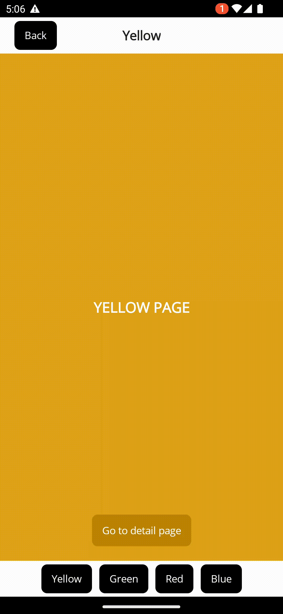
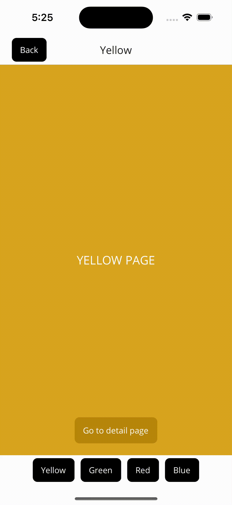
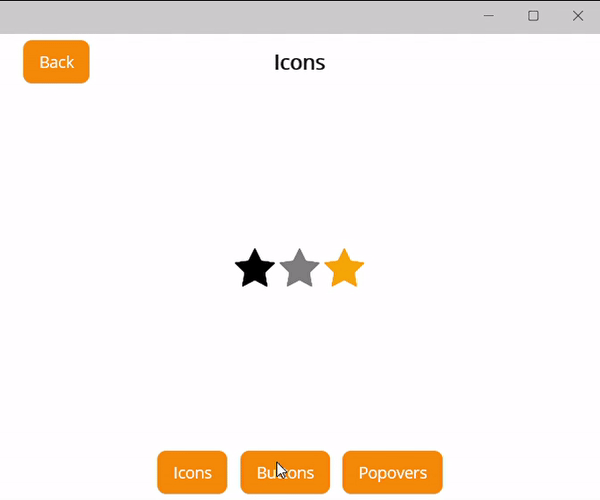
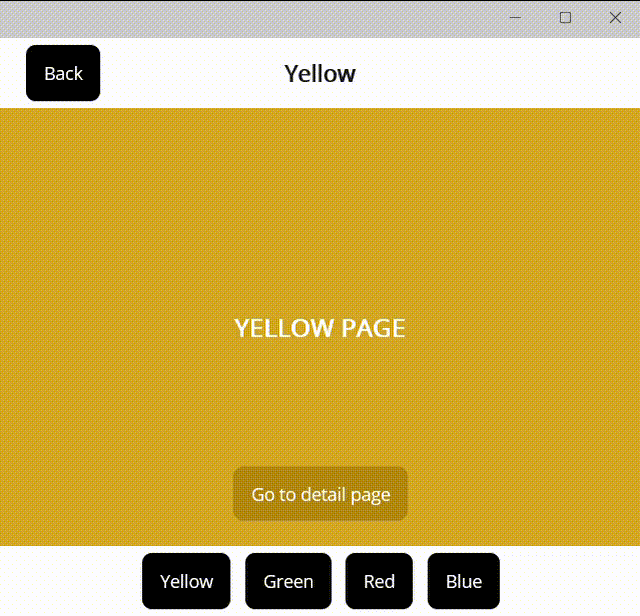
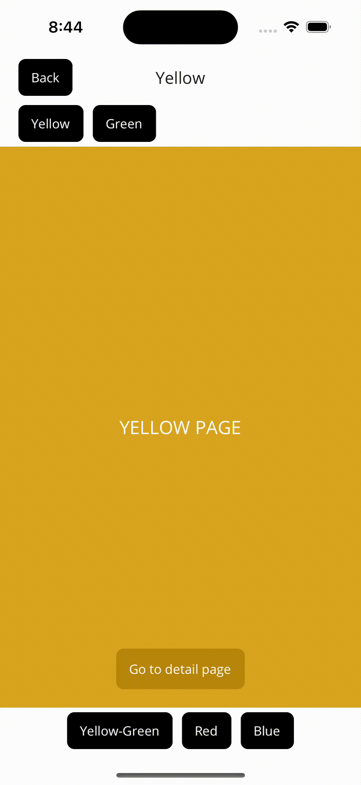
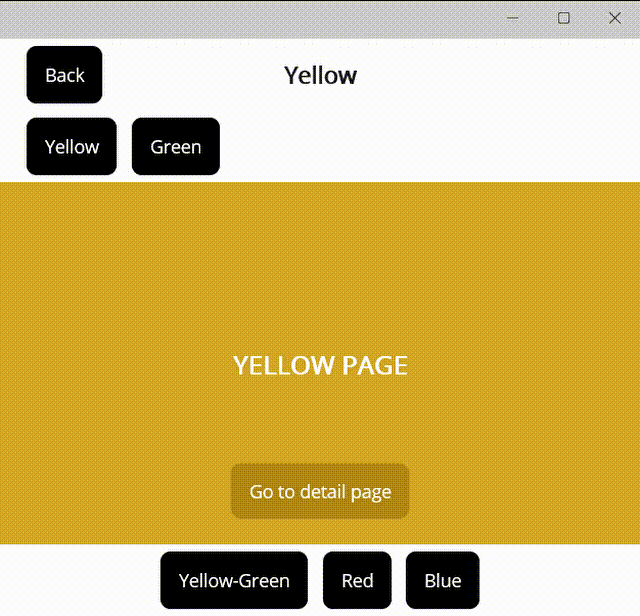

# SimpleToolkit.SimpleShell

[](https://www.nuget.org/packages/SimpleToolkit.SimpleShell/)

The *SimpleToolkit.SimpleShell* package provides you with a simplified implementation of .NET MAUI `Shell` that lets you easily create a custom navigation experience in your .NET MAUI applications.

> Before you begin using `SimpleShell`, I highly recommend familiarizing yourself with the normal `Shell` in .NET MAUI - especially with the URI-based [navigation](https://learn.microsoft.com/en-us/dotnet/maui/fundamentals/shell/navigation), which works exactly the same as in `SimpleShell`. 

## Getting Started

In order to use *SimpleToolkit.SimpleShell*, you need to call the `UseSimpleShell()` extension method in your `MauiProgram.cs` file:

```csharp
builder.UseSimpleShell();
```

## SimpleShell

`SimpleShell` is a simplified implementation of .NET MAUI `Shell`. All `SimpleShell` is is just a container for your content with the ability to put the hosting area for pages wherever you want, giving you the flexibility to add custom tab bars, navigation bars, flyouts, etc. to your `Shell` application while using great `Shell` URI-based navigation.

Let's say we have four root pages - `YellowPage`, `GreenPage`, `RedPage` and `BluePage` - and one detail page - `YellowDetailPage`. Shell with a simple app bar and tab bar can be defined like this:

```xml
<?xml version="1.0" encoding="UTF-8" ?>
<simpleShell:SimpleShell
    x:Class="SimpleToolkit.SimpleShellSample.AppShell"
    xmlns="http://schemas.microsoft.com/dotnet/2021/maui"
    xmlns:x="http://schemas.microsoft.com/winfx/2009/xaml"
    xmlns:simpleShell="clr-namespace:SimpleToolkit.SimpleShell;assembly=SimpleToolkit.SimpleShell"
    xmlns:pages="clr-namespace:SimpleToolkit.SimpleShellSample.Views.Pages"
    x:Name="thisShell">

    <!-- Pages can be grouped into tabs (ShellSections) -->
    <Tab
        Title="Yellow-Green"
        Route="YellowGreenTab">
        <ShellContent
            Title="Yellow"
            ContentTemplate="{DataTemplate pages:YellowPage}"
            Route="YellowPage"/>

        <ShellContent
            Title="Green"
            ContentTemplate="{DataTemplate pages:GreenPage}"
            Route="GreenPage"/>
    </Tab>

    <Tab
        Title="Red"
        Route="RedTab">
        <ShellContent
            Title="Red"
            ContentTemplate="{DataTemplate pages:RedPage}"
            Route="RedPage"/>
    </Tab>

    <Tab
        Title="Blue"
        Route="BlueTab">
        <ShellContent
            Title="Blue"
            ContentTemplate="{DataTemplate pages:BluePage}"
            Route="BluePage"/>
    </Tab>

    <simpleShell:SimpleShell.Content>
        <Grid
            RowDefinitions="50, *, 50">
            <Button
                x:Name="backButton"
                Clicked="BackButtonClicked"
                Text="Back"
                Margin="20,5"
                HorizontalOptions="Start"
                Background="Black"/>
            <Label
                Margin="20,5"
                HorizontalOptions="Center" VerticalOptions="Center"
                Text="{Binding CurrentShellContent.Title, Source={x:Reference thisShell}}"
                FontAttributes="Bold" FontSize="18"/>
            <simpleShell:SimpleNavigationHost
                Grid.Row="1"/>
            <HorizontalStackLayout
                x:Name="tabBar"
                Grid.Row="2"
                Margin="20,5"
                HorizontalOptions="Center" Spacing="10"
                BindableLayout.ItemsSource="{Binding ShellContents, Source={x:Reference thisShell}}">
                <BindableLayout.ItemTemplate>
                    <DataTemplate
                        x:DataType="BaseShellItem">
                        <Button
                            Clicked="ShellItemButtonClicked"
                            Background="Black"
                            Text="{Binding Title}"/>
                    </DataTemplate>
                </BindableLayout.ItemTemplate>
            </HorizontalStackLayout>
        </Grid>
    </simpleShell:SimpleShell.Content>

</simpleShell:SimpleShell>

```

As you can see, the logical navigation structure is defined with `ShellContent`, `Tab`, etc. as in normal .NET MAUI `Shell`. However, visual structure is defined manually using the `Content` property. The hosting area for pages is represented by the `SimpleNavigationHost` view that can occur in the visual hierarchy **just once**.

SimpleShell provides you with some **bindable properties** that you can bind to when creating custom navigation controls:

- `CurrentPage` - the currently selected `Page`
- `CurrentShellSection` - the currently selected `ShellSection` (`Tab`)
- `CurrentShellContent` - the currently selected `ShellContent`
- `ShellSections` - read-only list of all `ShellSection`s in the shell
- `ShellContents` - read-only list of all `ShellContent`s in the shell
- `RootPageContainer` - a view that will wrap all root pages (`ShellContent`s)

The code behind of the XAML sample above:

```csharp
public partial class AppShell : SimpleToolkit.SimpleShell.SimpleShell
{
	public AppShell()
	{
		InitializeComponent();

		Routing.RegisterRoute(nameof(YellowDetailPage), typeof(YellowDetailPage));
    }

    private async void ShellItemButtonClicked(object sender, EventArgs e)
    {
        var button = sender as Button;
        var shellItem = button.BindingContext as BaseShellItem;

        // Navigate to a new tab if it is not the current tab
        if (!CurrentState.Location.OriginalString.Contains(shellItem.Route))
            await GoToAsync($"///{shellItem.Route}", true);
    }

    private async void BackButtonClicked(object sender, EventArgs e)
    {
        await GoToAsync("..");
    }
}
```

Navigation between pages works exactly the same as in .NET MAUI `Shell`, just use the common `Shell.Current.GoToAsync()`. Pages that are not part of the shell hierarchy can be registered using the `Routing.RegisterRoute()` method.

Output:

<p align="center">
    <table>
        <tr>
            <th>
                <p align="center">Android</p>
            </th>
            <th>
                <p align="center">iOS</p>
            </th>
            <th>
                <p align="center">Windows</p>
            </th>
        </tr>
        <tr>
            <td>
                
            </td>
            <td>
                
            </td>
            <td>
                
            </td>
        </tr>
    </table>
</p>

## `RootPageContainer`

We usually do not want tab bars, floating buttons and other navigation elements to be visible on all of our pages. Because of this, we can specify a `RootPageContainer` view that will wrap all the root pages (`ShellContent`s).

Let's move the tab bar from the above sample to the `RootPageContainer` view:

```xml
<simpleShell:SimpleShell.RootPageContainer>
    <Grid
        RowDefinitions="*, 50">
        <simpleShell:SimpleNavigationHost/>
        <HorizontalStackLayout
            x:Name="tabBar"
            Grid.Row="1"
            Margin="20,5"
            HorizontalOptions="Center" Spacing="10"
            BindableLayout.ItemsSource="{Binding ShellContents, Source={x:Reference thisShell}}">
            <BindableLayout.ItemTemplate>
                <DataTemplate
                    x:DataType="BaseShellItem">
                    <Button
                        Clicked="ShellItemButtonClicked"
                        Background="Black"
                        Text="{Binding Title}"/>
                </DataTemplate>
            </BindableLayout.ItemTemplate>
        </HorizontalStackLayout>
    </Grid>
</simpleShell:SimpleShell.RootPageContainer>

<simpleShell:SimpleShell.Content>
    <Grid
        RowDefinitions="50, *">
        <Button
            x:Name="backButton"
            Clicked="BackButtonClicked"
            Text="Back"
            Margin="20,5"
            HorizontalOptions="Start"
            Background="Black"/>
        <Label
            Margin="20,5"
            HorizontalOptions="Center" VerticalOptions="Center"
            Text="{Binding CurrentShellContent.Title, Source={x:Reference thisShell}}"
            FontAttributes="Bold" FontSize="18"/>
        <simpleShell:SimpleNavigationHost
            Grid.Row="1"/>
    </Grid>
</simpleShell:SimpleShell.Content>
```

The `RootPageContainer` view has to contain a `SimpleNavigationHost` element somewhere in its view hieararchy. This element will host all the root pages.

Tab bar is not visible on the detail page:

<p align="center">
    <table>
        <tr>
            <th>
                <p align="center">Android</p>
            </th>
            <th>
                <p align="center">iOS</p>
            </th>
            <th>
                <p align="center">Windows</p>
            </th>
        </tr>
        <tr>
            <td>
                
            </td>
            <td>
                
            </td>
            <td>
                
            </td>
        </tr>
    </table>
</p>

## `ShellSectionContainer`

You can also specify a container view for each `ShellSection` (`Tab`) via the `ShellSectionContainerTemplate` attached property. The container view is defined using `DataTemplate` which allows the container to be created on demand in response to navigation.

The view defined in `ShellSectionContainerTemplate` property has to contain a `SimpleNavigationHost` element somewhere in its view hieararchy. This element will host the root pages.

Let's change the main tab bar from the above sample to display `ShellSection`s instead of all the root pages:

```xml
<simpleShell:SimpleShell.RootPageContainer>
    <Grid
        RowDefinitions="*, 50">
        <simpleShell:SimpleNavigationHost/>
        <HorizontalStackLayout
            x:Name="tabBar"
            Grid.Row="1"
            Margin="20,5"
            HorizontalOptions="Center" Spacing="10"
            BindableLayout.ItemsSource="{Binding ShellSections, Source={x:Reference thisShell}}">
            <BindableLayout.ItemTemplate>
                <DataTemplate
                    x:DataType="BaseShellItem">
                    <Button
                        Clicked="ShellItemButtonClicked"
                        Background="Black"
                        Text="{Binding Title}"/>
                </DataTemplate>
            </BindableLayout.ItemTemplate>
        </HorizontalStackLayout>
    </Grid>
</simpleShell:SimpleShell.RootPageContainer>
```

The `ShellSection` with two root pages will contain a top tab bar:

```xml
<Tab
    Title="Yellow-Green"
    Route="YellowGreenTab">
    <simpleShell:SimpleShell.ShellSectionContainerTemplate>
        <DataTemplate
            x:DataType="ShellSection">
            <Grid
                RowDefinitions="50, *">
                <HorizontalStackLayout
                    Margin="20,5"
                    HorizontalOptions="Start" Spacing="10"
                    BindableLayout.ItemsSource="{Binding Items}">
                    <BindableLayout.ItemTemplate>
                        <DataTemplate
                            x:DataType="BaseShellItem">
                            <Button
                                Clicked="ShellItemButtonClicked"
                                Background="Black"
                                Text="{Binding Title}"/>
                        </DataTemplate>
                    </BindableLayout.ItemTemplate>
                </HorizontalStackLayout>
                <simpleShell:SimpleNavigationHost
                    Grid.Row="1"/>
            </Grid>
        </DataTemplate>
    </simpleShell:SimpleShell.ShellSectionContainerTemplate>

    <ShellContent
        Title="Yellow"
        ContentTemplate="{DataTemplate pages:YellowPage}"
        Route="YellowPage"/>

    <ShellContent
        Title="Green"
        ContentTemplate="{DataTemplate pages:GreenPage}"
        Route="GreenPage"/>
</Tab>
```

Binding context of a view defined in the template is a respective `ShellSection` (`Tab`) instance.

<p align="center">
    <table>
        <tr>
            <th>
                <p align="center">Android</p>
            </th>
            <th>
                <p align="center">iOS</p>
            </th>
            <th>
                <p align="center">Windows</p>
            </th>
        </tr>
        <tr>
            <td>
                
            </td>
            <td>
                
            </td>
            <td>
                
            </td>
        </tr>
    </table>
</p>

## Transitions

`SimpleShell` allows you to define custom transitions between pages during navigation:

https://github.com/RadekVyM/SimpleToolkit/assets/65116078/694efb22-2a1f-4ec2-b169-307499357ae4

See [documentation](Transitions.md) for more information.

## Visual states

`SimpleShell` provides multiple groups of visual states which help to define the shell appearance based on the current state of navigation. See [documentation](VisualStates.md) for more information.

## Implementation details

The `SimpleShell` class is inherited from the .NET MAUI `Shell` class, but all the handlers are implemented from the ground up. These handlers are inspired by the WinUI version of `Shell` handlers.

## Why not use `SimpleShell` and use .NET MAUI `Shell` instead

- .NET MAUI `Shell` offers a platform-specific appearance.
- Platform-specific navigation controls that .NET MAUI `Shell` provides probably have better performance than controls composed of multiple .NET MAUI views.
- A `SimpleShell`-based application may not have as good accessibility in some scenarios due to the lack of platform-specific navigation controls. .NET MAUI `Shell` should be accessible out of the box since it uses platform-specific controls.
- Maybe I have implemented something wrong that has a negative impact on the performance, accessibility, or something like that.
