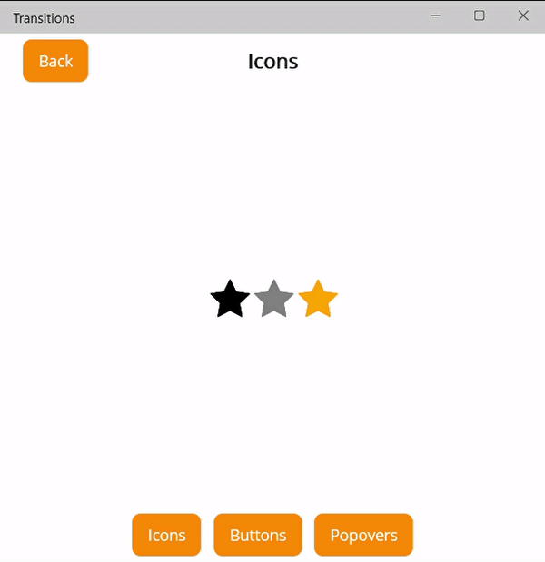
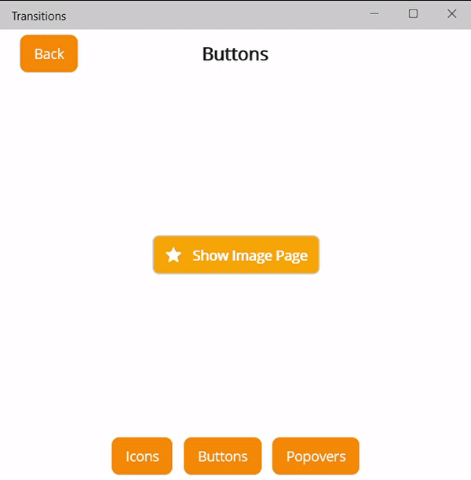

# `SimpleShell` page transitions

`SimpleShell` allows you to define custom transitions between pages during navigation.

## `SimpleShellTransition`

Each transition is represented by a `SimpleShellTransition` object which contains these read-only properties settable via its constructors:

- `Callback` - method that is called when progress of the transition changes. Progress of the transition is passed to the method through a parameter of type `SimpleShellTransitionArgs`
- `Starting` - method that is called when the transition starts
- `Finished` - method that is called when the transition finishes
- `Duration` - method returning duration of the transition
- `DestinationPageInFront` - method returning whether the destination page should be displayed in front of the origin page when navigating from one page to another

Each of these methods takes a object `SimpleShellTransitionArgs` as a parameter. Usefull information about currently running transition can be obtained from this object:

- `OriginPage` of type `VisualElement` - page from which the navigation is initiated
- `DestinationPage` of type `VisualElement` - destination page of the navigation
- `Progress` - progress of the transition. Number from 0 to 1
- `TransitionType` - type of the transition that is represented by `SimpleShellTransitionType` enumeration:
    - `Switching` - new root page (`ShellContent`) is being set
    - `Pushing` - new page is being pushed to the navigation stack
    - `Popping` - existing page is being popped from the navigation stack

## Setting a transition

`SimpleShellTransition` can be set to any page via `SimpleShell.Transition` attached property. If you set a transition on your `SimpleShell` object, that transition will be used as the default transition for all pages.

When navigating from one page to another, **transition of the destination page is played**.

> Every `ShellContent` needs to be placed inside a `Tab` element to play the transition while navigating between two root pages.

### Extension methods

Setting transition can be simplified using several extension methods. These are headers of the methods:

```csharp
public static void SetTransition(
    this Page page,
    SimpleShellTransition transition)

public static void SetTransition(
    this Page page,
    Action<SimpleShellTransitionArgs> callback,
    uint duration = 250,
    Action<SimpleShellTransitionArgs> starting = null,
    Action<SimpleShellTransitionArgs> finished = null,
    bool destinationPageInFrontOnSwitching = true,
    bool destinationPageInFrontOnPushing = true,
    bool destinationPageInFrontOnPopping = true)

public static void SetTransition(
    this Page page,
    Action<SimpleShellTransitionArgs> callback,
    Func<SimpleShellTransitionArgs, uint> duration = null,
    Action<SimpleShellTransitionArgs> starting = null,
    Action<SimpleShellTransitionArgs> finished = null,
    Func<SimpleShellTransitionArgs, bool> destinationPageInFront = null)

public static void SetTransition(
    this Page page,
    Action<SimpleShellTransitionArgs> switchingCallback = null,
    Action<SimpleShellTransitionArgs> pushingCallback = null,
    Action<SimpleShellTransitionArgs> poppingCallback = null,
    Func<SimpleShellTransitionArgs, uint> duration = null,
    Action<SimpleShellTransitionArgs> starting = null,
    Action<SimpleShellTransitionArgs> finished = null,
    Func<SimpleShellTransitionArgs, bool> destinationPageInFront = null)
```

## Example

The default transition can be set, for example, in the constructor of your `AppShell`:

```csharp
public AppShell()
{
    InitializeComponent();

    Routing.RegisterRoute(nameof(ImagePage), typeof(ImagePage));

    this.SetTransition(
        callback: args =>
        {
            switch (args.TransitionType)
            {
                case SimpleShellTransitionType.Switching:
                    args.OriginPage.Opacity = 1 - args.Progress;
                    args.DestinationPage.Opacity = args.Progress;
                    break;
                case SimpleShellTransitionType.Pushing:
                    args.DestinationPage.TranslationX = (1 - args.Progress) * args.DestinationPage.Width;
                    break;
                case SimpleShellTransitionType.Popping:
                    args.OriginPage.TranslationX = args.Progress * args.OriginPage.Width;
                    break;
            }
        },
        finished: args =>
        {
            args.OriginPage.Opacity = 1;
            args.OriginPage.TranslationX = 1;
            args.DestinationPage.Opacity = 1;
            args.DestinationPage.TranslationX = 1;
        },
        destinationPageInFront: args => args.TransitionType switch {
            SimpleShellTransitionType.Popping => false,
            _ => true
        },
        duration: args => args.TransitionType switch {
            SimpleShellTransitionType.Switching => 500,
            _ => 350
        });
}
```

Output:

<p align="center">
    
</p>

Transitions can be set on each page individually. Default transition will be overridden if it is already set:

```csharp
public ImagePage()
{
    InitializeComponent();

    this.SetTransition(
        callback: args =>
        {
            args.OriginPage.TranslationY = args.Progress * (-args.OriginPage.Height);
            args.DestinationPage.TranslationY = (1 - args.Progress) * (args.DestinationPage.Height);
        },
        500,
        finished: args =>
        {
            args.OriginPage.TranslationY = 0;
            args.DestinationPage.TranslationY = 0;
        });
}
```

Output:

<p align="center">
    
</p>
